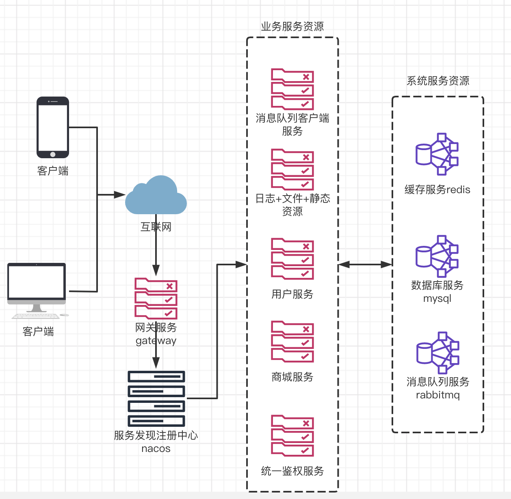
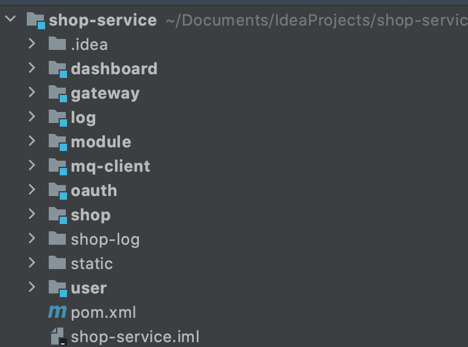
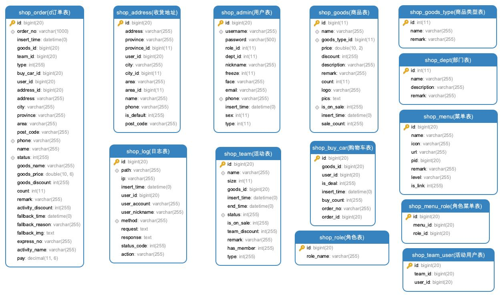

# 项目介绍

## 项目背景

该项目是为了迎合互联网时代在线购物产生的在线购物系统，包括管理平台和用户端两部分，管理平台实现了系统权限的配置，用户的管理，商品的管理，活动配置，订单管理，发货管理等，内部员工的管理功能等核心模块，用户端包括用户的注册，登录，商品的浏览，购物车的管理，购买商品，参加秒杀，在线下单等功能。


## 1项目架构介绍

### 1.1简介

本项目服务端基于SpringCloud+Redis+Gateway+Mysql+RabbitMQ组合来实现，具备分布式项目所拥有的高并发高可用的特性以及常用的灾备处理。客户端基于Vue+Webpack整合的单页面应用。后台管理系统架构组成为Vue+VueRouter+Vuex+ElementUI+Axios，移动端系统架构组成为Vue+VueRouter+Vuex+VantUI+Axios。

### 1.2架构图

本架构的所有业务符合以及系统架构关系如下图所示:



### 1.3项目结构

#### 1.3.1项目结构图

本项目结构图为下图所示：



#### 1.3.2项目结构说明

```sh
.
├── dashboard #dashboard-service:SpringAdminServer用于监控所有集群内部运行的服务和节点的运行状态，内存信息，健康状况，在线日志等内容。
├── gateway #gateway-service:SpringCloudGateway全局网关系统，用于做统一的访问入口，客户端访问gateway的请求可以直接转发到对应的服务中并得到响应，网关可以解决集群节点的负载均衡和熔断处理，当转发的服务节点是多个时网关会自动分流转发降低访问峰值，当转发的服务节点全部宕机时网关节点会自动对服务降级返回异常信息不会报错
├── log #log-service：统一日志+文件+静态资源服务，所有服务节点的http请求日志都会发送到该服务并存储到数据库记录请求的详细信息。同时文件上传也由该服务处理。项目的所有静态资源，图片，网页，视频等都由该服务承担处理
├── module #module：项目业务耦合模块，用来将所有项目的entity，service，mapper，feign等统一处理防止重复创建。
├── mq-client #mq-client-service：基于rabbitmq的消息队列客户端服务，用于处理秒杀业务和订单过期的批处理
├── oauth #oauth-service：基于oauth2.0的鉴权服务，用于实现跨服务的无状态用户登录以及鉴权acess_token的生成策略，实现单点登录
├── shop #shop-service：商城业务的业务服务，用于处理商城相关的业务接口，如下单，商品等
├── shop-log #日志存放文件夹，用于存放所有服务的运行日志文件以及报错信息
│   ├── dashboard-service.log
│   ├── gateway-service.log
│   ├── log-service.log
│   ├── mq-client-service.log
│   ├── shop-service.log
│   └── user-service.log
├── static #静态资源文件夹，通过/public/**访问，用于存放上传的图片以及网页的静态资源
│   ├── admin
│   └── mobel
└── user #user-service: 用户相关业务的业务服务，用于处理用户相关的业务接口，如登录
```

# 2.业务服务简介(SpringCloud项目部分)

### 2.1 dashboard-service(服务监控)

#### 2.1.1 核心依赖

```xml
<dependency>
    <groupId>de.codecentric</groupId>
    <artifactId>spring-boot-admin-starter-server</artifactId>
</dependency>
```

#### 2.1.2 服务简介

SpringBootAdmin是一个对SpringBoot服务进行监控的中间件，可以通过该服务连接所有需要监控的SpringBoot工程，他可以将当前服务所监控的服务状态，内存占用，垃圾回收详情，cpu占用，健康信息，线程数量等做详细监控，并且可以实时调整所监控服务的日志级别。实现集群管理的快速问题追踪。

### 2.2 gateway-service(网关系统)

#### 2.2.1 核心依赖

```xml
<dependency>
    <groupId>org.springframework.cloud</groupId>
    <artifactId>spring-cloud-starter-gateway</artifactId>
</dependency>
```

#### 2.2.2 服务简介

SpringCloud Gateway 是SpringCloud的新一代网关系统，主要用于将不同服务整合到一个网络地址下进行统一管理，并且针对不同的服务配置不同的转发规则可以理解为微服务项目的核心网络请求入口，如果对Zuul有了解的话可以理解为他们是一类工具。为什么应用SpringCloud Gateway，这就需要使用它与Zuul做一个基本对比，如下：

| **名称**   | **Zuul1**               | **Zuul2**                                          | **Spring Cloud Gateway**                              |
| ---------- | ----------------------- | -------------------------------------------------- | ----------------------------------------------------- |
| Path注入   | 不自带，部分可实现      | 不自带，可以自己实现                               | 自带                                                  |
| host转发   | 不支持                  | 不自带，可以自己实现                               | 自带                                                  |
| 动态代码   | 不支持                  | 可动态通过代码修改filter                           | 不支持                                                |
| 动态配置   | Archaius,Spring         | Netflix Archaius                                   | Spring（config+bus+actuator）或自开发                 |
| 网关高可用 | 云平台的LB+弹性，Eureka | 云平台的LB+弹性，Eureka                            | 云平台的LB+弹性，Eureka                               |
| 服务发现   | eureka                  | eureka                                             | eureka，nacos                                         |
| 功能扩展   | 只扩展过滤器            | 可创建路由规则，过滤规则                           | 路由规则，过滤规则都可扩展                            |
| 限流       | 信号量、线程数          | 内置限流统计，需要自己封装实现，集群可能需要自开发 | 引入redis计数，可细化到针对IP做限流，限流规则可自定义 |
| 熔断       | Hystrix降级             | 需要基于内置的统计做封装                           | 利用Hystrix                                           |
| 实现方式   | BIO                     | NIO                                                | NIO                                                   |

相比之下我们选择使用SpringCloud Gateway 作为网关，主要由于他配置更加简单，性能更加强大，并且是基于nio非阻塞访问模式可以实现更高的并发量以及他可以自由搭配更多的注册中心来使用。

### 2.3 log-service(日志+静态资源+文件服务)

#### 2.3.1 核心依赖

```xml
<dependency>
    <groupId>org.springframework.session</groupId>
    <artifactId>spring-session-data-redis</artifactId>
    <version>2.4.2</version>
</dependency>
<dependency>
    <groupId>mysql</groupId>
    <artifactId>mysql-connector-java</artifactId>
</dependency>
<dependency>
  <groupId>org.springframework.boot</groupId>
  <artifactId>spring-boot-starter-web</artifactId>
</dependency>
<dependency>
  <groupId>org.springframework.cloud</groupId>
  <artifactId>spring-cloud-starter</artifactId>
</dependency>
<dependency>
  <groupId>org.springframework.boot</groupId>
  <artifactId>spring-boot-starter-actuator</artifactId>
</dependency>
<dependency>
  <groupId>com.alibaba.cloud</groupId>
  <artifactId>spring-cloud-starter-alibaba-nacos-discovery</artifactId>
</dependency>
<dependency>
  <groupId>de.codecentric</groupId>
  <artifactId>spring-boot-admin-starter-client</artifactId>
</dependency>
<dependency>
  <groupId>org.springframework.boot</groupId>
  <artifactId>spring-boot-starter-data-redis</artifactId>
</dependency>
<dependency>
  <groupId>org.springframework.boot</groupId>
  <artifactId>spring-boot-starter-validation</artifactId>
</dependency>
<dependency>
  <groupId>com.baomidou</groupId>
  <artifactId>mybatis-plus-boot-starter</artifactId>
  <version>3.4.2</version>
</dependency>
<dependency>
  <groupId>com.alibaba</groupId>
  <artifactId>fastjson</artifactId>
  <version>1.2.75</version>
</dependency>
<dependency>
  <groupId>org.springframework.cloud</groupId>
  <artifactId>spring-cloud-starter-netflix-hystrix</artifactId>
</dependency>
```

#### 2.2.2 服务简介

log-service是项目中处理访问日志，静态资源，以及文件上传的核心服务。

基于SpringCloud,SpringDataRedis,SpringDataMabitsPlus,MysqlConnector等核心库实现，主要用于接受其他业务服务的日志处理请求，系统的日志查询，前端页面的静态资源保存，接受其他服务的文件上传请求。是项目网络请求诊断+静态资源处理的核心。

### 2.4 mq-service(消息队列处理服务)

#### 2.4.1 核心依赖

```xml
<dependency>
    <groupId>org.springframework.boot</groupId>
    <artifactId>spring-boot-starter-amqp</artifactId>
</dependency>
```

#### 2.4.2 服务简介

mq-service是基于RabbitMQ实现的消息队列处理的业务客户端，他的核心作用是接受并处理并发访问的下单请求并逐一生成订单，用于削峰（削减请求高峰），并且将接口中的大量业务处理放到队列中做异步处理，来实现降低并发访问时接口处理的时间，来让并发接口能快速响应结果。还有一个重要的用途就是通过死信队列机制来实现过期订单的回收和删除。

### 2.5 oauth-service(统一鉴权服务)

#### 2.5.1 核心依赖

```xml
<dependency>
    <groupId>org.springframework.cloud</groupId>
    <artifactId>spring-cloud-starter-oauth2</artifactId>
</dependency>
```

#### 2.5.2 服务简介

oauth-service服务基于SpringCloudOauth2.0认证系统，是一个实现跨服务保持单点登录状态的服务系统，该服务通过Oauth2+JWT实现了无状态token的生成，他主要用于接受用户登录请求实现登录token的生成。生成的token在过期之前可以脱离session在各个业务服务中进行使用，各个服务自带token验证机制，可以实现通过token来识别访问用户的身份信息和权限，并作出相应的拦截机制。

### 2.6 shop-service(商城业务服务)

#### 2.6.1 核心依赖

```xml
<dependency>
    <groupId>org.springframework.boot</groupId>
    <artifactId>spring-boot-starter-amqp</artifactId>
</dependency>
<dependency>
    <groupId>org.springframework.session</groupId>
    <artifactId>spring-session-data-redis</artifactId>
    <version>2.4.2</version>
</dependency>
<dependency>
    <groupId>mysql</groupId>
    <artifactId>mysql-connector-java</artifactId>
</dependency>
<dependency>
  <groupId>org.springframework.boot</groupId>
  <artifactId>spring-boot-starter-web</artifactId>
</dependency>
<dependency>
  <groupId>org.springframework.cloud</groupId>
  <artifactId>spring-cloud-starter</artifactId>
</dependency>
<dependency>
  <groupId>org.springframework.boot</groupId>
  <artifactId>spring-boot-starter-actuator</artifactId>
</dependency>
<dependency>
  <groupId>com.alibaba.cloud</groupId>
  <artifactId>spring-cloud-starter-alibaba-nacos-discovery</artifactId>
</dependency>
<dependency>
  <groupId>de.codecentric</groupId>
  <artifactId>spring-boot-admin-starter-client</artifactId>
</dependency>
<dependency>
  <groupId>org.springframework.boot</groupId>
  <artifactId>spring-boot-starter-data-redis</artifactId>
</dependency>
<dependency>
  <groupId>org.springframework.boot</groupId>
  <artifactId>spring-boot-starter-validation</artifactId>
</dependency>
<dependency>
  <groupId>com.baomidou</groupId>
  <artifactId>mybatis-plus-boot-starter</artifactId>
  <version>3.4.2</version>
</dependency>
<dependency>
  <groupId>com.alibaba</groupId>
  <artifactId>fastjson</artifactId>
  <version>1.2.75</version>
</dependency>
<dependency>
  <groupId>org.springframework.cloud</groupId>
  <artifactId>spring-cloud-starter-netflix-hystrix</artifactId>
</dependency>
```

#### 2.6.2 服务简介

shop-service服务是整个项目的核心业务模块，主要负责实现项目中商品管理，订单管理，活动管理，以及其他和商城有关的业务处理模块。

基于SpringCloud,SpringDataRedis,SpringDataMabitsPlus,MysqlConnector,SpringData RabbitMQ等核心库实现,与消息队列连接做并发削峰处理。

### 2.7 user-service(用户业务服务)

#### 2.7.1 核心依赖

```xml
<dependency>
    <groupId>org.springframework.boot</groupId>
    <artifactId>spring-boot-starter-amqp</artifactId>
</dependency>
<dependency>
    <groupId>org.springframework.session</groupId>
    <artifactId>spring-session-data-redis</artifactId>
    <version>2.4.2</version>
</dependency>
<dependency>
    <groupId>mysql</groupId>
    <artifactId>mysql-connector-java</artifactId>
</dependency>
<dependency>
  <groupId>org.springframework.boot</groupId>
  <artifactId>spring-boot-starter-web</artifactId>
</dependency>
<dependency>
  <groupId>org.springframework.cloud</groupId>
  <artifactId>spring-cloud-starter</artifactId>
</dependency>
<dependency>
  <groupId>org.springframework.boot</groupId>
  <artifactId>spring-boot-starter-actuator</artifactId>
</dependency>
<dependency>
  <groupId>com.alibaba.cloud</groupId>
  <artifactId>spring-cloud-starter-alibaba-nacos-discovery</artifactId>
</dependency>
<dependency>
  <groupId>de.codecentric</groupId>
  <artifactId>spring-boot-admin-starter-client</artifactId>
</dependency>
<dependency>
  <groupId>org.springframework.boot</groupId>
  <artifactId>spring-boot-starter-data-redis</artifactId>
</dependency>
<dependency>
  <groupId>org.springframework.boot</groupId>
  <artifactId>spring-boot-starter-validation</artifactId>
</dependency>
<dependency>
  <groupId>com.baomidou</groupId>
  <artifactId>mybatis-plus-boot-starter</artifactId>
  <version>3.4.2</version>
</dependency>
<dependency>
  <groupId>com.alibaba</groupId>
  <artifactId>fastjson</artifactId>
  <version>1.2.75</version>
</dependency>
<dependency>
  <groupId>org.springframework.cloud</groupId>
  <artifactId>spring-cloud-starter-netflix-hystrix</artifactId>
</dependency>
```

#### 2.7.2 服务简介

User-service服务是整个项目的核心业务模块，主要负责实现项目中用户管理，角色管理，部门管理，员工管理，商城用户的登录，注册等用户相关的模块以及其他和用户有关的业务处理模块。

基于SpringCloud,SpringDataRedis,SpringDataMabitsPlus,MysqlConnector,SpringCloud Oauth2等核心库实现,与鉴权服务连接实现单点登录。


## 3.系统服务简介(服务核心库)

### 3.1 Redis

redis服务作为该项目的缓存查询和分布式锁的核心库存在。采用默认6379端口，无密码模式连接

### 3.2 RabbitMQ

rabbitMQ为该项目使用的消息队列核心框架服务端用于保存和处理项目中涉及到的队列模型和消息管理

### 3.3 Nacos

nacos作为该项目的服务发现和注册中心，实现了多个服务的分布式整合和连接，实现跨服务访问的通道，这里单独介绍一下nacos与主流注册中心的对比结果

|                 | Nacos                      | **Eureka**  | Consul            | **CoreDNS** | Zookeeper  |
| :-------------- | :------------------------- | :---------- | :---------------- | :---------- | ---------- |
| 一致性协议      | CP+AP                      | AP          | CP                | —           | CP         |
| 健康检查        | TCP/HTTP/MYSQL/Client Beat | Client Beat | TCP/HTTP/gRPC/Cmd | —           | Keep Alive |
| 负载均衡策略    | 权重/ metadata/Selector    | Ribbon      | Fabio             | RoundRobin  | —          |
| 雪崩保护        | 有                         | 有          | 无                | 无          | 无         |
| 自动注销实例    | 支持                       | 支持        | 支持              | 不支持      | 支持       |
| 访问协议        | HTTP/DNS                   | HTTP        | HTTP/DNS          | DNS         | TCP        |
| 监听支持        | 支持                       | 支持        | 支持              | 不支持      | 支持       |
| 多数据中心      | 支持                       | 支持        | 支持              | 不支持      | 不支持     |
| 跨注册中心同步  | 支持                       | 不支持      | 支持              | 不支持      | 不支持     |
| SpringCloud集成 | 支持                       | 支持        | 支持              | 不支持      | 支持       |
| Dubbo集成       | 支持                       | 不支持      | 支持              | 不支持      | 支持       |
| K8S集成         | 支持                       | 不支持      | 支持              | 支持        | 不支持     |

这里复习一下cap原则

- C:一致性(Consistency) (所有节点在同一时间具有相同的数据)
- A:可用性(Availability) (保证每个请求不管成功或者失败都有响应)
- P:分隔容忍(Partition tolerance) (系统中任意信息的丢失或失败不会影响系统的继续运作)

由于CAP原则本质上无法保证三者兼得所以各个注册中心厂商都会取其二来进行架构设计，由于Eureka只支持AP模式虽然实现了较高的可用性，但是在节点丢失的情况下不能保证数据的一致性所以在生产环境中使用的比较少，Consul是比较常用的注册中心但是由于他CP采用强一致性，不管什么情况都要优先保证节点数据一致所以当主节点挂掉的时候Consul会进行选举选择新的主节点，这个过程中跨服务访问会失败。ZK（Zookeeper）相对来说是最老牌的注册中心，相对Consul来说性能更加强一些但是他的上手难度和治理成本要高很多。相对来说Nacos作为后起之秀并且是国内一线大厂阿里推出的，维护迭代稳定，并且可以切换cp和ap模式根据项目需求扩展，他自身提供了大量面配置操作使得性能上和上手难度都要更低所以新项目大量应用Nacos作为注册中心使用，这里我们也采用Nacos作为服务发现和注册中心

### 3.4 Mysql

本项目使用Mysql 5.7作为数据库存储容器，mysql就不多做介绍了。

## 4.数据库设计



